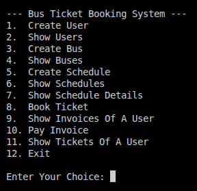

# Bus Ticket Booking System

Console-based bus ticket booking and billing system implemented with C# and OOP principles. The application manages users, buses, schedules, seat reservations, invoices, and payments in-memory.

## Features
- User management with unique mobile number and email validation
- Bus management with Business and Economy seat layouts
- Schedule management for routes, departure times, and ticket prices
- Seat selection with reservation hold and payment confirmation
- Invoice generation and payment tracking
- Menu-driven CLI for all operations

## Business Rules and Validation
- Mobile number must be 11 digits starting with `0`. The system stores it with a `+88` prefix.
- Email must include `@` and `.` and must be unique per user.
- Departure and arrival cities must differ and contain no digits.
- Departure date/time must be in the future (`yyyy-MM-dd HH:mm`).
- Ticket price must be between `0` and `9999.99`.
- Seat numbering:
  - Business: rows `1-9`, seats `A-C` (27 total)
  - Economy: rows `1-9`, seats `A-D` (36 total)
- Seats are reserved on booking and confirmed on payment.
- Unpaid reservations expire after 10 minutes.

## Getting Started

### Prerequisites
- .NET SDK targeting `net10.0`

### Run
```bash
dotnet run --project BusTicketBookingSystem.csproj
```

## Usage
Follow the on-screen menu to:
- Create and list users
- Create and list buses
- Create and list schedules
- View schedule details and seat layout
- Book tickets (creates an invoice)
- Pay invoices to confirm bookings
- View a user's invoices and paid tickets

## Screenshot


## Project Structure
- `Program.cs` - application entry point and menu handling
- `Services/BookingSystem.cs` - core business operations
- `Models/` - domain models (User, Bus, Schedule, Ticket, Invoice)
- `Enums/` - enum definitions for bus type and payment status
- `Utils/ValidationHelper.cs` - input validation utilities

## Notes
- Data is stored in memory and is cleared when the application exits.
- The seat layout view marks paid seats as booked.

## License
See `LICENSE`.
